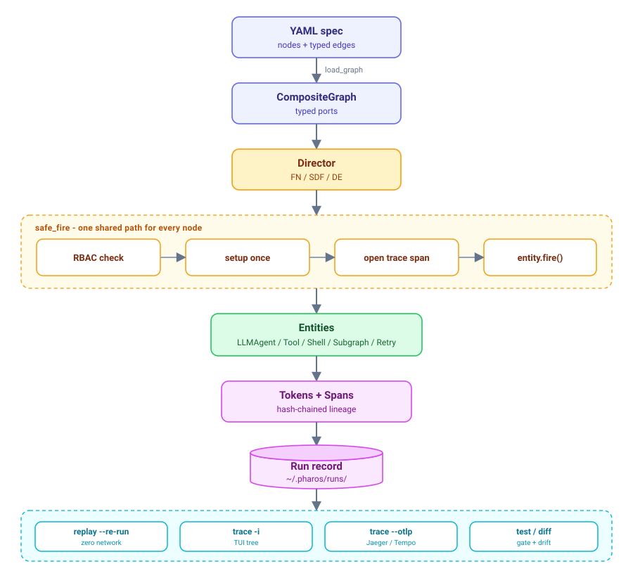
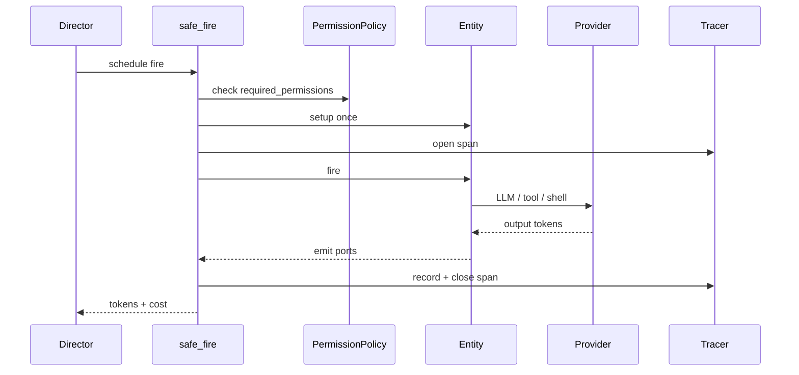

# pharos

> **LLM agents as typed dataflow graphs** — every run is traced, replayed offline, permission-gated, and **testable like code**.

Most agent frameworks give you a prompt chain. pharos gives you a **compiler + runtime**: a YAML graph compiles to typed ports, a **Director** schedules every node, and each fire goes through one shared `safe_fire` path (RBAC → trace span → hash-chained token). The full run is persisted — so you can **replay it without network**, gate it in CI with **`pharos test`**, and **`pharos diff`** exactly what changed between two runs.

| | LangChain-style chains | pharos |
| --- | --- | --- |
| **Structure** | Sequential prompts / ad-hoc loops | **Typed ports** + Directors (FN / SDF / DE) |
| **Observability** | Log scraping | **Hash-chained spans** → TUI or OTLP |
| **Safety** | Hope the agent behaves | **RBAC** enforced at every fire |
| **Regression** | Manual re-run, eyeball the output | **`pharos test`** offline gate + **`pharos diff`** |

<p align="center">
  
</p>

---

## Four core ideas

### 1. Typed ports — hallucination caught at the boundary

Edges aren't strings; they're **typed ports**. If a downstream node expects `{"file": str, "line": int}` and an LLM emits `{"path": ..., "ln": ...}`, it's rejected at the port with a `PortContractViolation` — not 5 minutes later when a bad patch lands. Declare an `output_schema` on an LLM node and mis-shaped JSON is caught, then auto-repaired (`max_repair_attempts` feeds the schema error back into the same conversation).

```yaml
nodes:
  - id: triage
    type: llm
    provider: minimax
    output_schema: { file: str, line: int, severity: str }   # validated on the json port
    max_repair_attempts: 2                                    # self-heal before failing
```

### 2. One `safe_fire` path — RBAC + trace on every node

Whatever the Director (FN / SDF / DE) and whatever the entity (LLM / shell / tool / subgraph), **every** fire flows through the same guarded path. RBAC, tracing, cost accounting, and record/replay apply uniformly — there's no way for a node to skip the permission check.



A shell-enabled coding agent can't `rm -rf /` unless you granted `bash:execute` — permissions are a deploy-time decision, enforced at fire time.

### 3. Hash-chained tokens — trace, replay, zero network

Every output `Token` is frozen and content-hashed into a lineage chain (`prev_hash` + `self_hash`). Two runs of the same graph + input should produce the same head hash; if not, something drifted and you'll know. Because every entity's outputs are captured (LLM **and** shell / python / tool / subgraph), a recorded run **replays byte-for-byte offline** — and exports to **OTLP** for Jaeger / Tempo, or a TUI span tree.

```bash
uv run pharos trace --interactive <run_id>                 # span tree, color-coded durations
uv run pharos replay --re-run --graph graph.yaml <run_id>  # reproduce with zero network calls
uv run pharos trace <run_id> --otlp out.json               # ship to any OTel backend
```

### 4. Agent CI — `test` and `diff` your agents

Multi-step agents have no unit tests and no `git diff`. pharos adds both on top of record/replay:

- **`pharos test`** turns a confirmed-good run into a golden **fixture** (graph hash, seed, outputs, a content `chain_digest`, assertions). CI replays it **offline** (zero network, per commit) and fails if the digest drifts or an assertion breaks. `--live` re-runs the real model and judges **drift**; `--junit` emits a report for pipelines.
- **`pharos diff`** aligns two runs by `node:fire.port` and shows *exactly* what changed — a JSON field path (`patch.line: 42 → 43`), a text line diff, a dropped tool call — and how it propagates downstream, instead of an opaque blob compare.

**Difference ≠ drift.** The live gate fails only on things you declared you care about: structural invariants (tool-call set changed, a port's shape changed, self-heal `repair_attempts` rose) and your assertions (`equals` / `contains` / `not_contains` / `regex` / `schema`). Pure wording changes are reported, not auto-failed. Re-bless a golden with `pharos test <fx> --live --update`.

```bash
# record once, then gate every commit
uv run pharos run graphs/03_faux_demo.yaml --input "say hi" \
    --record-fixture tests/agent/faux_demo.fixture.json --fixture-name faux-demo
uv run pharos test tests/agent/faux_demo.fixture.json          # offline, zero cost
uv run pharos test tests/agent/faux_demo.fixture.json --live   # re-run model, judge drift
uv run pharos diff <run_a> <run_b>                             # structural, node/port aligned
```

Wire it into CI with [.github/workflows/agent-ci.yml](.github/workflows/agent-ci.yml).

---

## A real coding agent

`graphs/coding-agent.yaml` — an LLM with 7 permission-gated tools:

```yaml
name: coding-agent
director: fn
nodes:
  - id: coder
    type: llm
    provider: minimax
    model: MiniMax-Text-01
    system: "You are a coding agent. Tools: bash, read, write, edit, delete, glob, grep. Be concise."
    tools: coding
    max_tool_iterations: 10
edges:
  - { src: __in__.prompt, dst: coder.prompt }
  - { src: coder.text,    dst: __out__.response }
```

```bash
$ uv run pharos run graphs/coding-agent.yaml \
    --input "Read /tmp/sample.py, find the typo, fix it" \
    --grant fs:read --grant fs:write
# coder calls read → edit → returns DONE
# tokens=1454  cost=$0.0015
# coder.tool_calls = [{"name": "read", ...}, {"name": "edit", ...}]
```

---

## Quickstart

```bash
git clone https://github.com/qiu01shi/pharos.git && cd pharos && uv sync --all-extras

# Zero-cost demo — FauxProvider, no API key
uv run pharos run graphs/03_faux_demo.yaml --input "say hi"

# Real LLM — MiniMax (Anthropic-compatible)
echo "MINIMAX_CN_API_KEY=sk-..." > ~/.pharos/.env
uv run pharos run graphs/minimax-demo.yaml --input "1+1=?"
```

Full install + `.env` setup: [docs/quickstart.md](docs/quickstart.md).

---

## Also built in

- **6 providers** + ReplayProvider — OpenAI, Anthropic, DeepSeek, GLM, MiniMax, Faux
- **9 entities** — LLM, Shell, Router, Memory, Human (HITL, pause/resume), Tool, Subgraph, Retry + custom Python
- **7 coding tools** — bash, read, write, edit (anchor-validated), delete, glob, grep — each RBAC-gated
- **3 Directors** — FN (topological), SDF (feedback, K-of-N convergence), DE (event-driven)
- **Composability** — embed a whole graph as one `type: subgraph` node (nested Directors, `ref` + `ref_sha` pin, cycle detection)
- **Resilience & governance** — `retry:` backoff, run-level budgets (`--max-cost` / `--max-tokens`), `pharos resume` for partial runs
- **SQLite trace index** — `pharos trace query --entity/--since/--min-cost` across sessions

**Deliberately not:** web UI, multi-machine distributed execution, IDE plugin, vision `read`. Rationale in [docs/architecture.md](docs/architecture.md).

---

## Docs

| Doc | What |
| --- | --- |
| [quickstart.md](docs/quickstart.md) | Install, first real-LLM run, `.env` setup |
| [architecture.md](docs/architecture.md) | Design rationale, `safe_fire`, token hash chain, layer contracts |
| [cookbook.md](docs/cookbook.md) | Multi-reviewer, SDF feedback, coding agent, subgraphs |
| [ARCH-COMPOSABILITY.md](docs/ARCH-COMPOSABILITY.md) | Tool nodes, subgraph embedding, unified RBAC |

---

## Status

**v0.2.0** · 430 tests · ruff + mypy clean · coverage gate 78% · P95 ≈ 10 ms (100 concurrent actors)

**Near-term:** real-API tool-calling integration tests, Anthropic native structured output. **Later:** vision `read`, more Directors (PN / CT), full SDF checkpoint.

---

## License

MIT
