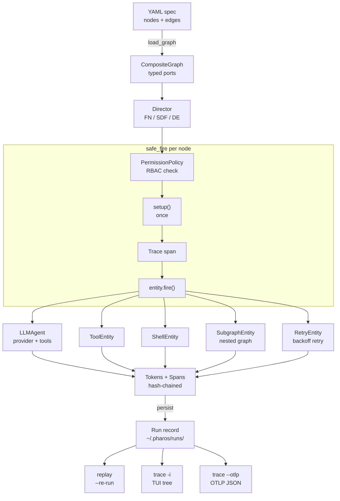
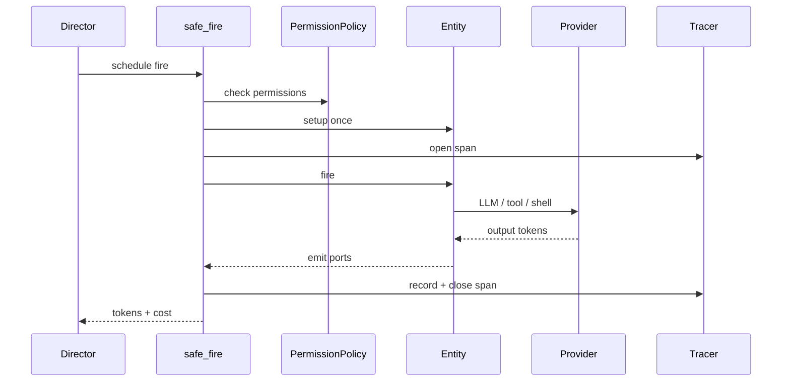

# pharos

> **Typed dataflow runtime for LLM workflows — with first-class trace, replay, and permissions.**

pharos turns a multi-step LLM workflow into a **typed dataflow graph**: nodes are LLM calls / shell commands / Python code, edges are typed ports, and a **Director** drives the firing cycle. Every fire is wrapped in a span, every token is content-hashed into a lineage chain, and runs are **recorded and replayed** with zero network calls — so a run becomes a regression artifact you can **test** and **diff** like code.

Built to answer two real pain points:

- **Multi-step LLM workflows are untraceable.** A bug-fix pipeline that runs "analyze → patch → test → review" gives you no way to see which step spent the tokens or which one hung.
- **Tool-using agents are ungovernable.** A coding agent with shell access can `rm -rf /` while you sleep. pharos makes tool permissions a first-class deployment decision.

---

## Architecture

From a YAML graph to a replayable, traced run:



Every node fires through one shared `safe_fire` path, so RBAC, tracing, and
record/replay apply uniformly regardless of the Director:



### Layered design

```
pharos/
├── core/             Token / Port / Entity / Graph / PermissionPolicy (typed dataflow primitives)
├── directors/        FN (topo) / SDF (feedback) / DE (event-driven) + shared safe_fire
├── entities/         LLMAgent / Shell / Router / Memory / HumanEntity / ToolEntity / SubgraphEntity / RetryEntity / ToolRegistry
├── llm/              LLMProvider Protocol + 6 providers + ReplayProvider
│   ├── providers/    openai / anthropic / deepseek / glm / minimax / faux / replay
│   └── catalog/      Model metadata per provider (cost, context window)
├── observability/    Trace (Span + Events) / SQLite index / OTLP export / TUI viewer
├── ir/               YAML graph loader (Pydantic schema)
├── runtime/          Trace persistence (~/.pharos/runs/) + record/replay + resume
├── env.py            Auto-load ~/.pharos/.env (shell env wins)
└── cli.py            7 subcommands: run / validate / list-providers / doctor / trace (--otlp, query) / replay / resume
```

---

## Capabilities

### What pharos does

- ✅ **6 LLM providers** — OpenAI, Anthropic, DeepSeek, GLM, MiniMax (Anthropic-compatible), Faux (+ ReplayProvider)
- ✅ **3 Directors** — FN (one-shot topological), SDF (feedback loop, K-of-N stable convergence), DE (event-driven)
- ✅ **9 built-in Entities** — `LLMAgent`, `ShellEntity`, `Router`, `Memory`, `HumanEntity`, `ToolEntity`, `SubgraphEntity`, `RetryEntity`, plus custom Python classes via YAML
- ✅ **7 Coding tools** — `bash`, `read`, `write`, `edit` (anchor-validated), `delete`, `glob`, `grep`
- ✅ **Tool calling loop** — LLM emits tool calls, pharos executes them, feeds results back, loops up to N turns
- ✅ **Parallel tool execution** — multiple tool calls in one round run via `asyncio.gather`
- ✅ **Schema-validated ports** — ports accept a JSON Schema (subset); mis-shaped LLM JSON is rejected at the boundary (`PortContractViolation`)
- ✅ **Structured LLM output** — declare `output_schema` on an LLM node; validated JSON is emitted on the `json` port (pairs with `retry:` for auto-repair)
- ✅ **Streaming** — `text_delta` events emitted live to downstream ports
- ✅ **Permission RBAC** — each Entity declares `required_permissions`; `RunContext.granted_permissions` enforces at fire time
- ✅ **Cross-process trace** — every span (event, attribute, duration) persisted to `~/.pharos/runs/<uuid>.json`
- ✅ **TUI viewer** — `pharos trace --interactive <id>` shows span tree with color-coded durations
- ✅ **OTLP export** — `pharos trace <id> --otlp out.json` emits OpenTelemetry OTLP/JSON for Jaeger / Tempo / any collector (`post_otlp()` for OTLP/HTTP)
- ✅ **Replay** — `pharos replay --re-run --graph <yaml> <id>` reproduces a run with zero network calls
- ✅ **`.env` loader** — auto-loads `~/.pharos/.env` (shell env wins, no `python-dotenv` dependency)
- ✅ **Multi-port inputs** — `--input-extra port=value` seeds any number of `__in__.<port>` edges
- ✅ **Template substitution** — `--var key=value` replaces `${NAME}` in double-quoted YAML strings
- ✅ **Subgraph composability** — embed a whole graph as one node (`type: subgraph`), with its own Director (heterogeneous nested scheduling), YAML `ref`, and cycle detection
- ✅ **Tools as first-class nodes** — `type: tool` schedules a single tool as a graph node with typed ports and its own RBAC
- ✅ **Retry with backoff** — add `retry: { max_attempts, backoff_s }` to any node to re-fire it on failure (wraps the node in a `RetryEntity`)
- ✅ **General record/replay** — every entity's output tokens (shell / python / tool / subgraph, not just LLM) are captured and re-emitted for byte-equal offline replay
- ✅ **Agent CI — `pharos test`** — record a golden run as a fixture, then gate it: offline replay recomputes a `chain_digest` and re-checks assertions (zero network, per-commit), or `--live` re-runs the real model and judges drift; `--junit` for CI
- ✅ **Agent CI — `pharos diff`** — structurally diff two runs aligned by node/fire/port (JSON field paths, text line diffs) with downstream propagation, instead of an opaque blob compare
- ✅ **Structured-output self-heal** — set `max_repair_attempts` on an LLM node to feed the schema error back into the same conversation and re-ask before falling back to `on_invalid`
- ✅ **Resume partial runs** — `pharos resume <run_id> --graph <yaml>` replays completed fires and runs the rest live (checkpoint without re-doing finished work)
- ✅ **Run-level budgets** — YAML `budget:` or `--max-cost` / `--max-tokens` abort (or warn) when spend exceeds the cap
- ✅ **Human-in-the-loop** — `type: human` pauses for approval/input, RBAC-gated (`human:input`), trace-recorded; continue with `--answer node=value` or `pharos resume`
- ✅ **SQLite trace index** — runs indexed to `~/.pharos/trace.db`; `pharos trace query --entity/--since/--min-cost` for cross-session queries
- ✅ **Subgraph ref pinning** — optional `ref_sha:` on `type: subgraph` detects when a referenced graph changed since recording

### What pharos deliberately doesn't do

- ❌ Web UI / dashboard (CLI + TUI only)
- ❌ Multi-machine distributed execution (single-process by design)
- ❌ IDE integration (no LSP, no in-editor live agent)
- ❌ Fuzzy string matching for `edit` (anchor must match exactly — quote chars included)
- ❌ Vision / image reading (text-only `read` tool)
- ❌ Live streaming UI (CLI prints after run completes; trace is post-hoc)

---

## Quickstart

```bash
# Clone and install
git clone https://github.com/qiu01shi/pharos.git
cd pharos
uv sync --all-extras

# 1. Zero-cost demo (FauxProvider — no API key needed)
uv run pharos run graphs/03_faux_demo.yaml --input "say hi"

# 2. Real LLM via MiniMax (Anthropic-compatible at minimaxi.com)
echo "MINIMAX_CN_API_KEY=sk-..." > ~/.pharos/.env
uv run pharos run graphs/minimax-demo.yaml --input "1+1=?"

# 3. Coding agent (7 tools, permission-gated)
uv run pharos run graphs/coding-agent.yaml \
    --input "Read /tmp/sample.py, find the typo, fix it" \
    --grant bash:execute --grant fs:read --grant fs:write

# 4. Inspect a recorded run
uv run pharos trace list
uv run pharos trace --interactive <run_id>

# 5. Replay offline (no network, byte-equal)
uv run pharos replay --re-run --graph graphs/minimax-demo.yaml <run_id>

# 6. Structured output + retry (schema-validated JSON on the json port)
uv run pharos run graphs/10_structured.yaml --input "bug in main.py line 42"

# 7. Query run history across sessions
uv run pharos trace query --entity coder --min-cost 0.001

# 8. Agent CI — record a golden fixture, then gate it in CI
uv run pharos run graphs/03_faux_demo.yaml --input "say hi" \
    --record-fixture tests/agent/faux_demo.fixture.json --fixture-name faux-demo
uv run pharos test tests/agent/faux_demo.fixture.json          # offline, zero cost
uv run pharos test tests/agent/ --junit report.xml             # gate a directory
uv run pharos test tests/agent/faux_demo.fixture.json --live   # re-run real model, judge drift

# 9. Diff two runs structurally (node/port aligned, not an opaque blob)
uv run pharos diff <run_a> <run_b>
```

---

## Agent CI: test and diff your agents

Multi-step agents have no unit tests and no `git diff`. pharos adds both,
building on two primitives it already has — typed ports and record/replay.

- **`pharos test`** turns a confirmed-good run into a golden **fixture** (graph
  hash, seed, recorded outputs, a content `chain_digest`, and assertions). CI
  replays it **offline** (zero network, per commit) and fails if the digest
  drifts or an assertion breaks; `--live` re-runs the real model and judges
  **drift** (a difference is not automatically a failure — see below).
- **`pharos diff`** aligns two runs by `node:fire.port` and shows exactly what
  changed — a JSON field path (`patch.line: 42 → 43`), a text line diff, a
  dropped tool call — and how it propagates downstream.

**Difference ≠ drift.** The live verdict fails only on things you declared you
care about: structural/behavioral invariants (tool-call set changed, an output
port appeared/disappeared, a JSON output's *shape* changed, or self-heal
`repair_attempts` rose) and your assertions (`equals` / `contains` /
`not_contains` / `regex` / `schema`). Pure wording changes are reported but do
not fail the gate. Re-bless a golden with `pharos test <fx> --live --update`.

Wire it into GitHub Actions with [.github/workflows/agent-ci.yml](.github/workflows/agent-ci.yml).

---

## A real coding workflow

`graphs/coding-agent.yaml`:
```yaml
name: coding-agent
director: fn
nodes:
  - id: coder
    type: llm
    provider: minimax
    model: MiniMax-Text-01
    system: |
      You are a coding agent. Tools: bash, read, write, edit, delete, glob, grep.
      When asked to work with files, USE the tools. Be concise.
    max_tokens: 1000
    tools: coding
    max_tool_iterations: 10
edges:
  - { src: __in__.prompt, dst: coder.prompt }
  - { src: coder.text,    dst: __out__.response }
```

```bash
$ uv run pharos run graphs/coding-agent.yaml \
    --input "Use read tool to read /tmp/sample.py and reply DONE" \
    --grant fs:read
# ... LLM streams, calls read, returns DONE ...
# tokens=1454 cost=$0.0015
# __out__.result = DONE
# coder.tool_calls = [{"name": "read", "arguments": {"path": "/tmp/sample.py"}}]
# coder.usage = {"input": 1452, "output": 2, ...}
```

---

## Why pharos

| What you get | What you don't get |
| --- | --- |
| ✅ Typed ports with schema validation at LLM boundaries | ❌ Drop-in LangChain replacement |
| ✅ Real coding tools (`bash/read/write/edit/...`) in 444 lines | ❌ IDE integration (VS Code plugin) |
| ✅ Permission RBAC on every entity + tool | ❌ Web dashboard (CLI + TUI only) |
| ✅ Cross-process trace with token hash chain | ❌ Multi-machine distributed execution |
| ✅ Byte-equal replay without network | ❌ Fuzzy match / smart-quote handling |
| ✅ Auto-load `~/.pharos/.env` (no python-dotenv) | ❌ Image / vision tool reading |
| ✅ 100 concurrent actors: **P95 ≈ 10ms** | ❌ GUI drag-and-drop editor |

---

## Performance

```
pharos 100-actor benchmark (bench/hello_world.py):

  100 LLM calls  (faux provider, ~10 ms each, serial: ~1000 ms)
  + FN Director (topological, asyncio.gather per layer)

  P50:   9.8 ms
  P95:  10.5 ms
  P99:  12.1 ms
  Speedup vs serial: ~100x
```

The dataflow runtime has near-zero overhead — 90 concurrent entities finish in the same time as 1 entity would alone.

---

## Documentation

- [docs/quickstart.md](docs/quickstart.md) — install + first run
- [docs/architecture.md](docs/architecture.md) — design rationale, layered contracts, token-hash semantics
- [docs/cookbook.md](docs/cookbook.md) — real workflows (multi-reviewer, custom entities, streaming, SDF feedback, etc.)
- [docs/ARCH-COMPOSABILITY.md](docs/ARCH-COMPOSABILITY.md) — tool nodes, subgraph embedding, general record/replay, unified RBAC
- [docs/P0-COMPLETE.md](docs/P0-COMPLETE.md) — [docs/P8-COMPLETE.md](docs/P8-COMPLETE.md) — per-phase retrospectives

---

## Current status

| Phase | What | Status |
| --- | --- | --- |
| P0 | Core abstractions, FN Director, FauxProvider, trace, perf baseline | ✅ |
| P1 | OpenAI + GLM providers, YAML IR, CLI, trace persistence | ✅ |
| P2 | Anthropic + DeepSeek providers, Router + Memory entities, SDF Director | ✅ |
| P3 | Custom Python entities from YAML, deterministic replay inspection | ✅ |
| P4 | DE Director (trigger-driven firing) | ✅ |
| P5 | ReplayProvider + `pharos replay --re-run` (byte-equal replay, no network) | ✅ |
| P6 | TUI viewer (`pharos trace -i`) + integration test scaffolding | ✅ |
| P8 | Tool calling loop for LLMAgent | ✅ |
| A | CLI multi-port seed (`--input-extra`) + template substitution (`--var`) | ✅ |
| B | Permission declarations + RBAC enforcement | ✅ |
| MiniMax | MiniMax provider (Anthropic-compatible) + `.env` auto-load + real-API verification | ✅ |
| Coding Agent | 7 coding tools (`bash/read/write/edit/delete/glob/grep`) + CLI integration | ✅ |
| Arch pass | Unified `safe_fire`/`PermissionPolicy`, bounded trace, general (non-LLM) record/replay, `ToolEntity` as a node | ✅ |
| Subgraph | `SubgraphEntity` — embed a graph as one node (heterogeneous nested Directors, YAML `ref`, cycle detection, namespaced replay) | ✅ |
| CI / quality | GitHub Actions (3.11/3.12): ruff + mypy (0 errors, gating) + pytest with coverage floor | ✅ |
| Resilience / obs | `RetryEntity` (`retry:` block) + OTLP/JSON trace export (`trace --otlp`, `post_otlp`) | ✅ |
| Packaging | v0.2.0, hatchling wheel + sdist, trusted-publishing workflow (TestPyPI / PyPI) | ✅ |
| Typed contracts | JSON Schema on ports + `output_schema` structured LLM output (`json` port) + `max_repair_attempts` self-heal | ✅ |
| Resume | `pharos resume` — replay completed fires, run the rest live; subgraph `ref_sha` integrity pin | ✅ |
| Governance | Run-level budgets (`budget:` / `--max-cost`) + `HumanEntity` (`human:input`, pause/resume) | ✅ |
| Trace index | `SQLiteTraceBackend` + `pharos trace query` cross-session run history | ✅ |
| Agent CI | `pharos test` (golden fixtures, offline replay gate + `--live` drift + `--junit`) and `pharos diff` (structured node/port diff); cross-run-stable token hash chain | ✅ |

**Numbers**:
- 430 tests (2 integration skipped without API key), 0 lint errors, 0 mypy errors
- CI gate on Python 3.11 + 3.12: ruff + mypy + pytest, coverage gate at 78%
- 100 concurrent actors: P95 ≈ 10ms
- 6 LLM providers + ReplayProvider
- 3 Directors: FN / SDF / DE
- 9 built-in Entities: `LLMAgent`, `ShellEntity`, `Router`, `Memory`, `HumanEntity`, `ToolEntity`, `SubgraphEntity`, `RetryEntity` + custom Python — plus ToolRegistry (7 coding tools)
- 9 CLI subcommands: run / validate / list-providers / doctor / trace / replay / resume / test / diff

---

## Roadmap

Contributions welcome. Recent four-pillar work (typed contracts, resume, governance, trace index) is shipped — see **Current status** above.

**Near-term**

- **Real-API integration tests for tool-calling** — OpenAI and Anthropic already serialize tools (`_convert_tools` in each provider); add coverage behind the existing `integration` pytest marker.
- **Anthropic native structured output** — wire `response_schema` through Anthropic tool-use / JSON mode (OpenAI chat + responses APIs are done).

**Later**

- **Vision / multimodal `read`** — `TypedValue` already allows an `image` type; wire an image-capable read tool and provider path.
- **More Directors (PN / CT)** — the [pharos/ir/__init__.py](pharos/ir/__init__.py) `DirectorName` comment notes these were planned.
- **Full SDF checkpoint** — persist port buffers + LLM conversation history each iteration (resume today replays completed entity fires only).

---

## Project layout

```
pharos/
├── pharos/
│   ├── core/             Token / Port / Entity / Graph (typed dataflow)
│   ├── llm/              LLMProvider Protocol + providers + catalog
│   │   ├── providers/    openai / anthropic / deepseek / glm / minimax / faux / replay
│   │   └── catalog/      Model metadata per provider
│   ├── directors/        FN (topo) / SDF (feedback) / DE (event-driven) + make_director
│   ├── entities/         LLMAgent / Shell / Router / Memory / HumanEntity / ToolEntity / SubgraphEntity / RetryEntity + tools (coding / builtin)
│   ├── observability/    Trace / SQLite index / OTLP export / TUI viewer
│   ├── ir/               YAML graph loader (Pydantic schema)
│   ├── runtime/          Trace persistence + record/replay + resume
│   ├── testing/          Agent CI: chain_digest / structured diff / fixtures / gate runner
│   ├── env.py            Auto-load ~/.pharos/.env
│   └── cli.py            `pharos` command (run / validate / list-providers / doctor / trace / replay / resume / test / diff)
├── graphs/               Sample workflows (structured output, human gate, subgraph, retry, etc.)
├── tests/                430 tests across ~28 modules
├── bench/                Performance baselines (hello_world.py)
├── scripts/              End-to-end verification scripts
└── docs/                 Architecture / quickstart / cookbook + 9 phase retrospectives
```

---

## License

MIT