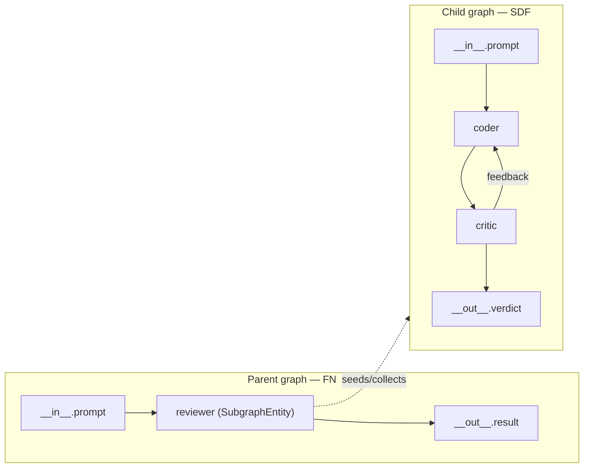

# pharos — Composability & General Replay

**Status:** done. **324 tests pass, ruff clean, 0 mypy errors (gating), CI on 3.11 + 3.12.**

This page covers the architecture work layered on top of the P0–P8 core:
first-class tool nodes, subgraph embedding, and moving the replay boundary
down to every entity's output. It complements the per-phase
`docs/P*-COMPLETE.md` retrospectives.

---

## 1. Tools as first-class graph nodes (`ToolEntity`)

Historically a tool could only run *inside* an `LLMAgent`'s tool-call loop:
invisible to the Director, permission-checked only inside `ToolRegistry`, and
shown in the trace as an event rather than a node.

`pharos/entities/tool_node.py` promotes one registered tool to a graph node so
it can be wired with typed ports, scheduled by any Director, RBAC-checked at the
graph level (same code path as every other entity), and traced/replayed like a
normal node.

```yaml
# graphs/07_tool_node.yaml
nodes:
  - id: reader
    type: tool          # <-- schedules a single tool as a node
    tool: read
    preset: coding       # which ToolRegistry preset to resolve `tool` in
edges:
  - { src: __in__.input,  dst: reader.input }
  - { src: reader.output, dst: __out__.content }
```

Ports:
- `args` (json) — full argument object, **or**
- `input` (text) — convenience single-string arg, mapped to the tool's first
  required parameter (override with `arg_key`).
- `output` (text) — the tool result; `error` (text) is populated on failure.

The tool's `required_permission` is copied onto the instance's
`required_permissions`, so the Director enforces it before the node fires.

---

## 2. Subgraph composability (`SubgraphEntity`)

The mechanism behind nesting: a whole `CompositeGraph` is embedded as one node
in a parent graph. Rather than teaching every Director about nested graphs, we
wrap the child in an Entity (`pharos/entities/subgraph.py`). The parent Director
schedules it like any other node, so permission checks, tracing, record/replay,
and metric collection in `safe_fire` all apply for free.

```yaml
# graphs/08_subgraph.yaml (parent)
nodes:
  - id: review
    type: subgraph
    ref: _reviewer_subgraph.yaml   # relative to this file
    # director: sdf                # optional override; else the child's own
    inputs:  { prompt: prompt }     # optional public -> internal rename
    outputs: { verdict: verdict }
edges:
  - { src: __in__.prompt, dst: review.prompt }
  - { src: review.verdict, dst: __out__.result }
```

Key properties:

- **Heterogeneous nested scheduling.** The child keeps its own `director`
  (declared in its YAML or overridden via `director:`), so a parent `fn` graph
  can embed an `sdf` feedback subgraph. `make_director(name, ...)` in
  `pharos/directors/__init__.py` is the shared factory used by both the CLI and
  `SubgraphEntity`.
- **Ports auto-derived** from the child's `__in__` / `__out__` edges (public
  name == internal port name) unless `inputs` / `outputs` rename maps are given.
- **Permission union.** The node surfaces the union of the child entities'
  `required_permissions` so the parent Director can fail fast.
- **Cycle detection.** `load_graph` threads an in-progress file set so a
  `ref` cycle (A -> B -> A) fails with a clear error instead of recursing
  forever. Relative refs require a `base_dir` (the CLI passes the main graph's
  directory).

Each `fire()` seeds the child's `__in__` ports from this node's inputs, runs the
child to completion with its own Director, then copies the child's `__out__`
results back out.



---

## 3. General record/replay (beyond LLM)

Previously only LLM provider calls were replayable. The replay boundary now sits
at every entity's **output** layer, so shell / python / tool / subgraph nodes
reproduce byte-for-byte too.

- `RunRecorder` (`pharos/runtime/__init__.py`) captures each entity's emitted
  output tokens, keyed `"{prefix}{node_id}:{fire_index}"`. `RunReplayer`
  re-emits them. `record_run` persists this cache in the run file.
- **Namespacing for nesting.** `RunRecorder.child(prefix)` writes into the same
  dict under a nested prefix (e.g. `reviewer/coder:0`), so a subgraph's inner
  nodes are captured without key collisions.
- `safe_fire` skips permission checks and `setup()` in replay mode (no network,
  no grants required). `pharos replay --re-run` prefers this general path and
  falls back to the LLM `ReplayProvider` for legacy runs.

---

## 4. Cross-cutting foundation

- **Unified firing.** One `safe_fire()` + `build_edge_index()` in
  `pharos/directors/base.py`; FN/SDF/DE share the scheduling skeleton and wrap
  `run()` in `try/finally` to `teardown_all()`.
- **Unified RBAC.** `pharos/core/permissions.py` (`PermissionPolicy`) is one
  decision function with a capability alias table (e.g. `bash:execute` ->
  `shell:execute`), routed through by both the Director and `ToolRegistry`.
- **Bounded trace.** `Span` caps events per span and truncates attributes
  (`PHAROS_TRACE_MAX_EVENTS` / `PHAROS_TRACE_MAX_ATTR`) so long runs with large
  tool outputs don't grow memory without bound.

---

## Reproduction

```bash
uv sync --all-extras --frozen
uv run ruff check pharos tests
uv run mypy pharos                       # 0 errors
uv run pytest -q -m "not integration"    # 324 passed
uv run pharos run graphs/07_tool_node.yaml --input-extra input=README.md --grant fs:read
uv run pharos run graphs/08_subgraph.yaml --input "fix the off-by-one bug"
```
